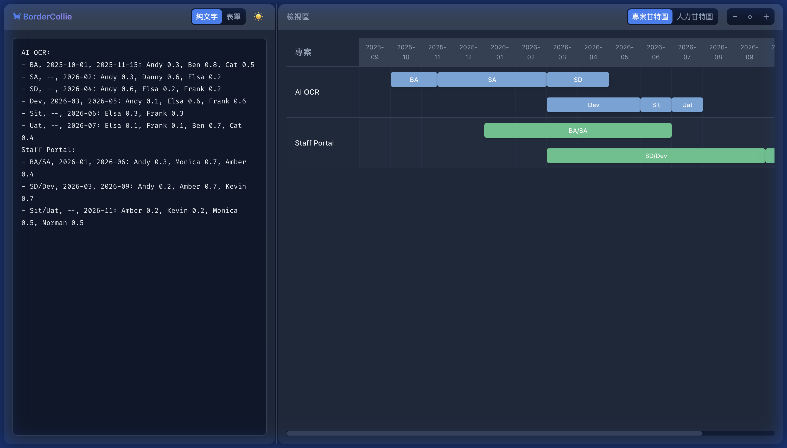
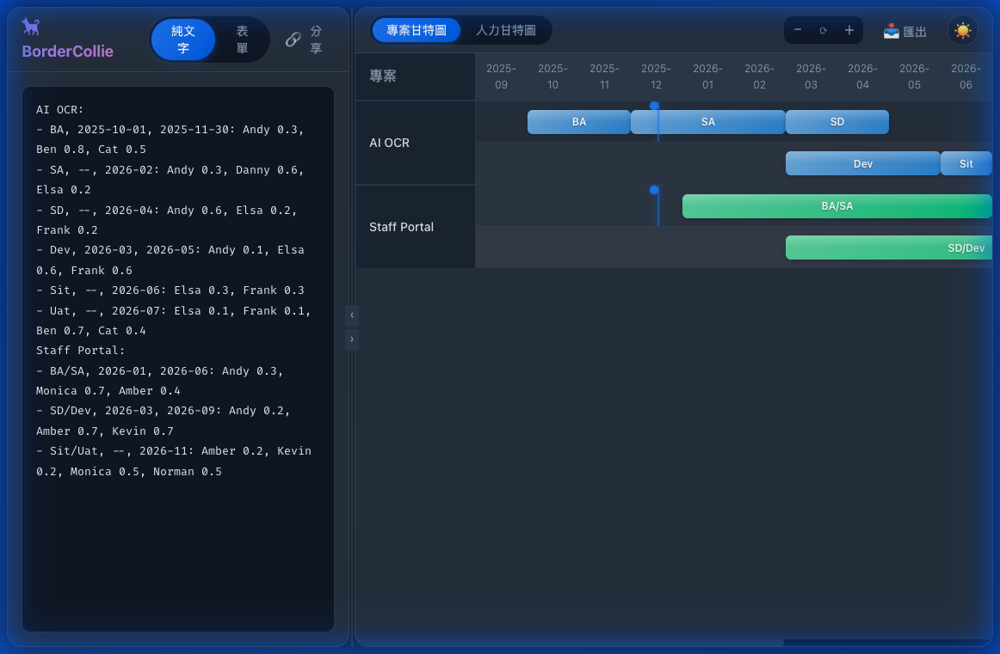
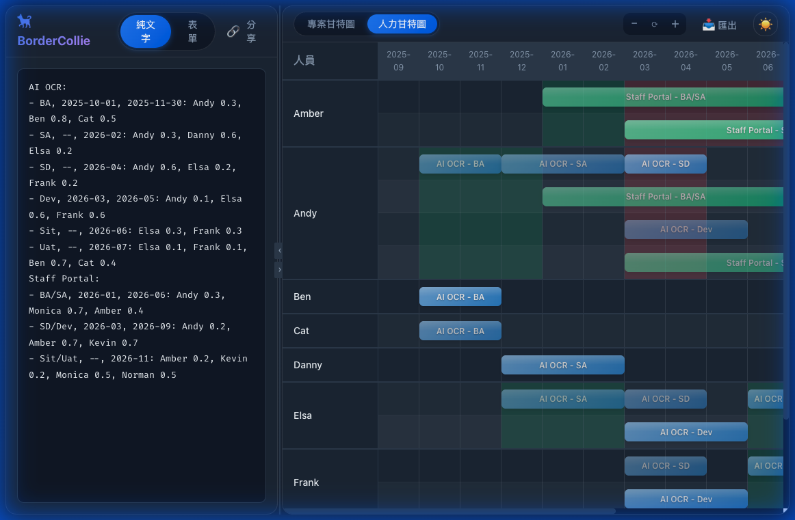

# 🐕 BorderCollie - 專案管理甘特圖

BorderCollie 是一個現代化、輕量級的專案管理與人力資源甘特圖工具。它專為快速編輯與視覺化設計，支援純文字格式定義專案，並即時轉換為互動式甘特圖。



## ✨ 特色功能

-   **雙視圖切換**：
    -   **專案甘特圖 (Project Gantt)**：以專案為核心，展示各階段時程與相依性。
    -   **人力甘特圖 (Person Gantt)**：以人員為核心，視覺化每位成員在不同專案間的投入狀況與工作負載。
-   **雙顯示模組**：
    -   **標準區塊 (Block)**：傳統甘特圖條塊。
    -   **箭頭樣式 (Arrow)**：專案流程視覺化，以箭頭表現階段順序，支援重疊與陰影效果，清楚呈現階段間的接續關係。
-   **純文字編輯 (Text-to-Gantt)**：使用簡單直覺的純文字語法快速定義專案、階段與人員指派。
-   **精美現代 UI**：
    -   **Glassmorphism 設計**：毛玻璃面板標題，漸層背景與陰影效果。
    -   **今日標記**：紅色大頭針標記當日位置，從日期列垂直貫穿整個甘特圖。
    -   **年度時間軸**：首月顯示完整年月，其他月份簡化顯示，不同年度交替背景色。
    -   **動態互動效果**：滑鼠懸停放大、平滑過渡動畫、主題切換特效。
    -   **高對比文字**：優化漸層色與文字陰影，確保在各種背景下文字清晰可讀。
    -   **直覺切換按鈕**：使用彩色漸層 Icon 與反向邏輯指示 (Show Next State)，提供更直覺的操作體驗。
-   **即時互動**：
    -   支援左右面板拖拉調整 (Split Pane) 與收縮功能。
    -   深色 (Dark) / 淺色 (Light) 主題切換。
    -   甘特圖縮放 (Zoom In/Out)。
-   **智慧排程與負載計算**：
    -   自動處理專案階段的時間接續 (Inherited Dates)。
    -   人力甘特圖自動計算每月平均負載 (Man-Days Average)，並以紅/綠燈號警示過載或閒置。
    -   智慧行分配，優化畫面空間利用。
-   **多專案工作區 (Workspace)**：
    -   支援多組專案儲存於 LocalStorage，快速切換不同專案。
    -   使用 Frontmatter 格式定義專案名稱、描述等元資料。
    -   分享連結衝突處理：可選擇覆蓋、重新命名或取消。
-   **便捷分享**：
    -   內建 **分享連結** 功能，將甘特圖資料使用 LZ-String 壓縮編碼於 URL 中，無需後端即可分享。




## 🚀 快速開始

### 線上體驗

**https://kywk.github.io/BorderCollie/**

### 本地執行

請參考 [INSTALL.md](./INSTALL.md) 了解詳細安裝與部署步驟。

## 📝 純文字編輯規格

BorderCollie 使用自定義的純文字格式來描述專案。格式設計目標是「可讀性高」且「易於輸入」。

### 完整格式範例

```text
name: AI 專案規劃 2025
description: 年度 AI 專案時程與人力配置
---
AI OCR:
- BA, 2025-10-01, 2025-11-30: Andy 0.3, Ben 0.8, Cat 0.5
- SA, --, 2026-02: Andy 0.3, Danny 0.6, Elsa 0.2
- SD, --, 2026-04: Andy 0.6, Elsa 0.2, Frank 0.2
- Dev, 2026-03, 2026-05: Andy 0.1, Elsa 0.6, Frank 0.6
- Sit, --, 2026-06: Elsa 0.3, Frank 0.3
- Uat, --, 2026-07: Elsa 0.1, Frank 0.1, Ben 0.7, Cat 0.4

Staff Portal:
- BA/SA, 2026-01, 2026-06: Andy 0.3, Monica 0.7, Amber 0.4
- SD/Dev, 2026-03, 2026-09: Andy 0.2, Amber 0.7, Kevin 0.7
- Sit/Uat, --, 2026-11: Amber 0.2, Kevin 0.2, Monica 0.5, Norman 0.5
```

### 語法說明

#### Frontmatter（選用）

Frontmatter 位於檔案開頭，以 `---` 分隔符結束，用於定義工作區元資料：

| 欄位 | 必填 | 說明 |
|------|------|------|
| `name` | ✅ | 工作區名稱（顯示於下拉選單） |
| `description` | ❌ | 專案描述（顯示於下拉選單提示） |
| `gist` | ❌ | Gist ID（未來支援雲端同步） |
| `createdAt` | ❌ | 建立時間 |

> 若無 Frontmatter，系統會自動生成預設工作區名稱。

#### 專案內容

1.  **專案宣告**：以 `專案名稱:` 開頭（冒號結尾）
2.  **階段定義**：以 `-` 開頭，欄位以 `,` 分隔
    -   格式：`- 階段名, 開始日期, 結束日期: 人員指派`
    -   **日期格式**：支援 `YYYY-MM`（月視圖）或 `YYYY-MM-DD`
    -   **自動接續**：開始日期填 `--`，表示接續前一階段結束時間
3.  **人員指派**：位於冒號 `:` 之後，多人以 `,` 分隔
    -   格式：`人員名稱 投入比例`
    -   投入比例為 `0.1` ~ `1.0`（代表 10% ~ 100%）

## 🛠️ 技術架構

-   **Frontend Framework**: Vue 3 + TypeScript
-   **Build Tool**: Vite
-   **State Management**: Pinia
-   **Styling**: Vanilla CSS (Variables & Scoped CSS)
-   **Utils**: `lz-string` (URL 壓縮編碼)

## 📄 License

MIT
